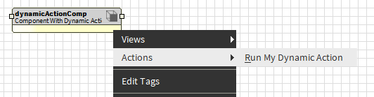
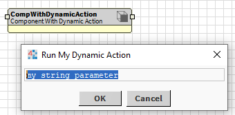

# Adding a dynamic action

This component adds an action to itself on startup, so it is a dynamic slot rather than a frozen one.

To test, add a `BComponentWithDynamicAction` component to your station.

Right click and see that it has an action with a customised display name (also set up by the component).
Also see that a dialog pops up to input its parameter.
\
\
\

\
\

\
\
The equivalent of the 'do' method for frozen actions is the `#invoke` method (see `BDynamicAction#invoke`). This is where the action's functionality goes.

To run the action from code, you can use `BComponent#invoke` and `BComplex#getAction` like this:
\
`invoke(getAction("myAction"), BString.make("my string value"));`
