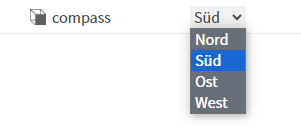
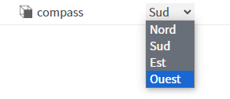
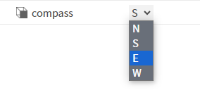

# Lexiconizing an enum

Here we have a frozen enum - BCompassEnum.
Its values are north, south, east and west

In the standard enum field editor - a dropdown menu - the default display values for this enum will be capitalized:
North, South, East and West
\
(see `BFrozenEnum#getDisplayTag` - module://docDeveloper/doc/baja-rt/javax/baja/sys/BFrozenEnum.bajadoc)

The Niagara framework automatically regards the enum's values as lexicon keys for the module owner of the enum.

We can set up translations in the following way
1. Add lexicon files containing the translations (in this case lexicons/bajaSamples.lexicon.de & lexicons/bajaSamples.lexicon.fr)
2. Add configuration using the lexicons tag in module-include.xml to tell the framework to use these files for a particular module/language combination. 
\
Note the use of the unicode character `\u00FC` in the de lexicon to show ü.
3. Include the lexions files in the jar by adding config to `<myModule>-rt.gradle` (in this case bajaSamples-rt.gradle) 

To try this out, add a `BCompassEnum` slot to a property sheet.
You can then start workbench with the locale flag:
\
`wb -locale:de`
\
`wb -locale:fr`

Or change the locale in your browser.

\

You can also change the default display values using lexicons.
In this example, keys have been added to module.lexicon, so in the English locale the dropdown will now have values:
N, S, E & W

\

